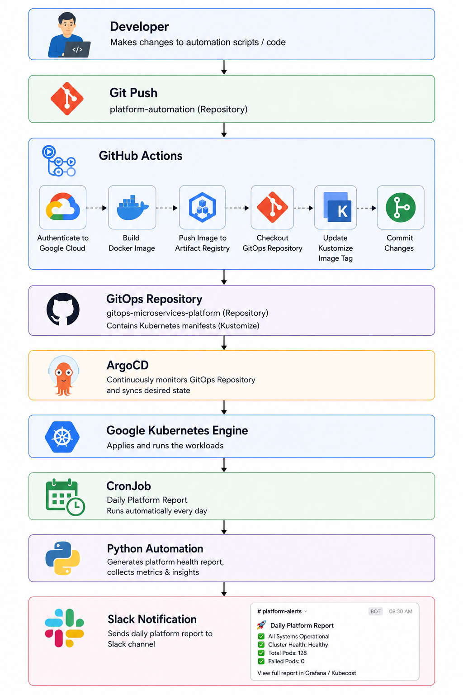

---

## Overview

**Cluster Operations** contains the CI/CD workflows responsible for building, securing, versioning, and delivering operational automation workloads to a GitOps-managed Kubernetes platform.

Rather than deploying directly to Kubernetes, this repository follows GitOps principles:

- Build container images
- Publish images to Google Artifact Registry
- Update Kubernetes manifests in the GitOps repository
- Let ArgoCD reconcile the desired state into Google Kubernetes Engine (GKE)

This approach provides a fully auditable, declarative, and automated deployment workflow.

---
## Table of Contents

- [Overview](#overview)
- [Repository Responsibilities](#repository-responsibilities)
- [Current Automation](#current-automation)
  - [Daily Platform Report](#daily-platform-report)
- [Architecture](#architecture)
- [CI/CD Workflow](#cicd-workflow)
- [Deployment Workflow](#deployment-workflow)
- [Runtime Execution](#runtime-execution)
- [Secure Authentication](#secure-authentication)
- [Technologies](#technologies)
- [Repository Structure](#repository-structure)
- [Related Repositories](#related-repositories)
- [Key Features](#key-features)
- [Learning Outcomes](#learning-outcomes)
- [License](#license)

---
## Repository Responsibilities

This repository automates:

- Docker image builds
- Google Cloud authentication using Workload Identity Federation (OIDC)
- Container image publishing
- GitOps manifest updates
- Kustomize image version management
- Automated deployment promotion
- CI/CD pipeline execution using GitHub Actions

---
## Current Automation

### Daily Platform Report

The repository currently builds and delivers the **Daily Platform Report** automation.

The application is deployed as a Kubernetes **CronJob** through GitOps and automatically generates a daily operational report that is delivered to Slack.

The report includes platform health information such as:

- Cluster status
- Node health
- Pod health
- Deployment status
- Resource utilization
- Platform summary

---
## Architecture

<p align="left">
  
</p>


---
## CI/CD Workflow

The GitHub Actions pipeline performs the following steps:

```
Source Code
      │
      ▼
Checkout Repository
      │
      ▼
Authenticate to Google Cloud
      │
      ▼
Configure Docker
      │
      ▼
Build Docker Image
      │
      ▼
Push Image to Artifact Registry
      │
      ▼
Checkout GitOps Repository
      │
      ▼
Update Kustomize Image Tag
      │
      ▼
Commit Updated Manifest
      │
      ▼
Push Changes
      │
      ▼
ArgoCD Synchronization
      │
      ▼
Deploy Updated CronJob
```

---
## Deployment Workflow

Unlike traditional CI/CD pipelines, this repository does **not** deploy directly to Kubernetes.

Deployment is fully GitOps-driven.

```
GitHub Actions
        │
        ▼
Artifact Registry
        │
        ▼
GitOps Repository
        │
        ▼
ArgoCD
        │
        ▼
Google Kubernetes Engine
        │
        ▼
CronJob Deployment
```

---
## Runtime Execution

Once deployed, Kubernetes executes the automation according to the CronJob schedule.

```
Cron Schedule
      │
      ▼
Kubernetes CronJob
      │
      ▼
Run Python Application
      │
      ▼
Collect Platform Metrics
      │
      ▼
Generate Daily Report
      │
      ▼
Send Slack Notification
```

---
## Secure Authentication

The CI pipeline authenticates to Google Cloud using **Workload Identity Federation (OIDC)**.

No service account keys are stored in GitHub.

Authentication flow:

```
GitHub Actions
        │
        ▼
OIDC Token
        │
        ▼
Workload Identity Pool
        │
        ▼
Google Service Account
        │
        ▼
Artifact Registry
```

---
## Technologies

| Category | Technologies |
|----------|--------------|
| CI/CD | GitHub Actions |
| Cloud | Google Cloud Platform |
| Containers | Docker |
| Registry | Artifact Registry |
| Kubernetes | Google Kubernetes Engine |
| GitOps | ArgoCD |
| Configuration | Kustomize |
| Automation | Python |
| Notifications | Slack Webhooks |

---
## Repository Structure

```
platform-automation/
│
├── .github/
│   └── workflows/
│       └── daily-platform-report-ci.yaml
│
├── daily-platform-report/
│   ├── Dockerfile
│   ├── requirements.txt
│   ├── main.py
│   ├── report.py
│   ├── slack.py
│   └── config.py
│
├── docs/
│
└── README.md
```

---
## Related Repositories

| Repository | Purpose |
|------------|---------|
| **platform-infra** | Terraform infrastructure provisioning |
| **gitops-microservices-platform** | Kubernetes manifests and GitOps configuration |
| **voting-app** | Sample cloud-native microservices application |
| **platform-automation** | CI/CD pipelines and operational automation |

---
## Key Features

- GitHub Actions CI/CD
- Workload Identity Federation (OIDC)
- Docker image automation
- Artifact Registry publishing
- GitOps-based deployments
- Automated Kustomize image updates
- ArgoCD continuous reconciliation
- Kubernetes CronJob automation
- Daily Slack operational reporting
- Production-inspired deployment workflow

---
## Learning Outcomes

This project demonstrates practical implementation of:

- Production-grade GitHub Actions workflows
- GitOps continuous delivery
- Google Cloud authentication using OIDC
- Container image lifecycle management
- Kubernetes CronJobs
- Platform operational automation
- Slack integration for operational reporting
- Cloud-native CI/CD best practices

---
## License

This project is licensed under the MIT License.